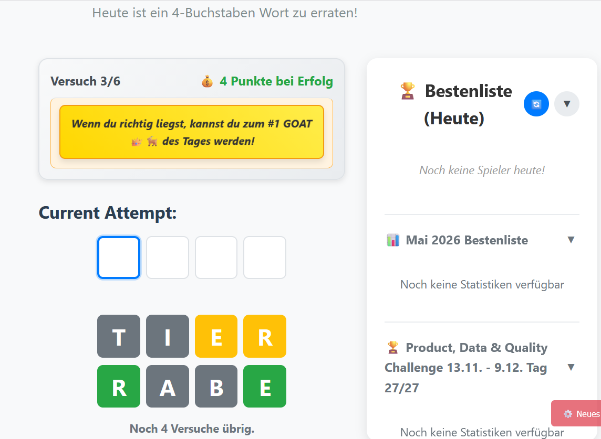
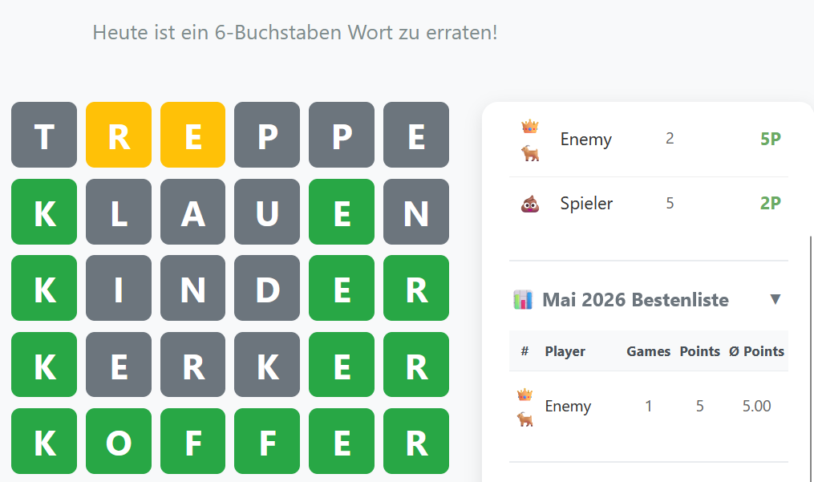
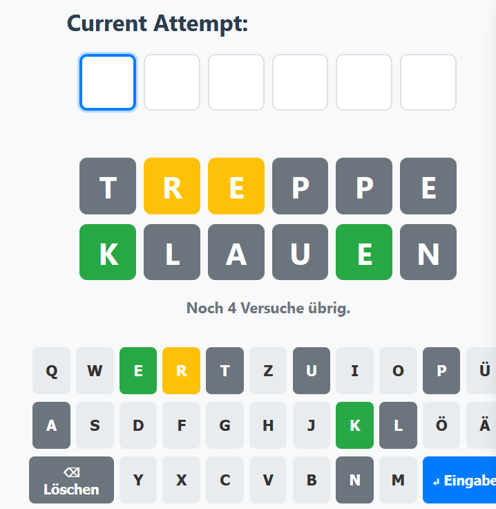
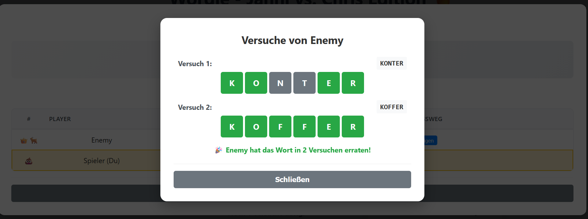

# German Wordle — AI-Powered Word Guessing Game

[](https://www.python.org/)
[](https://flask.palletsprojects.com/)
[](https://cloud.google.com/vertex-ai)
[](LICENSE)

> **Note:** This is a showcase repository derived from a private production application. It has been modified to remove sensitive information and personal data while maintaining the technical implementation and architecture for portfolio purposes.

## 📋 Table of Contents

- [Overview](#overview)
- [Key Features](#key-features)
- [Technology Stack](#technology-stack)
- [Architecture](#architecture)
- [Technical Highlights](#technical-highlights)
- [Project Structure](#project-structure)
- [Setup & Installation](#setup--installation)
- [Configuration](#configuration)
- [API Documentation](#api-documentation)
- [Deployment](#deployment)
- [Development](#development)
- [Performance & Optimization](#performance--optimization)
- [Security Considerations](#security-considerations)
- [Future Enhancements](#future-enhancements)
- [License](#license)

---

## 🎯 Overview

A modern, cloud-native implementation of Wordle for German language. Actually, a we were playing it with a few friends but got bored that it's only 5 letters and that there's nothing like having built-in friendlist or leaderboards. So, I decided to build my own version with the possibility of different word lengths, integrated competition scoreboard and some minor silly features.
Features:
- **AI-powered word generation** using Google's Vertex AI (Gemini 2.0)
- **Intelligent word validation** with natural language understanding
- **Real-time leaderboards** with competitive scoring
- **Responsive design** optimized for mobile and desktop
- **Production-grade infrastructure** with Docker, Terraform, and CI/CD

### Game Mechanics

- Daily challenge with a new German word (4-11 letters)
- Up to 6 attempts to guess the word
- Color-coded feedback: 🟩 correct, 🟨 misplaced, ⬜ absent
- Point system rewarding fewer attempts
- Daily and monthly leaderboards

<div align="center">

| Game Board | Leaderboard | Coloured Keyboard | Insights to completed games |
|:---:|:---:|:---:| :---: |
|  |  |  | 
| *Active game with color-coded feedback* | *Daily, monthly and special leaderboards with point system and rankings* | *color-coded keyboard to comprehend which letters are valid or non-valid to use* | *Victory screen with scores and possibility to see insights of other players' guesses* |

</div>


---

## ✨ Key Features

### 🤖 AI Integration

**Why AI at all?**
It is a simple but non-trivial problem to get all german words which exist and especially to only use those german words which are suitable and valid for the game: there is one daily word which has to be guessed by the players - this word should be a "common" word, e.g. if it's a verb, it should be in its base form; as for nouns, they should not include proper nouns and so on. In other words, for the daily word to guess, the problem to solve was to 1) get a full dictionary of german words, 2) only make use of a subset of this dictionary which satisfies a certain ruleset and 3) randomly choose a word out of this subset without repetitions. A second, minor challenge is to validate the guesses the players submit: Again, players should not be able to cheat, e.g. by simply using "A E I O U" as a first guess, since all guesses must also be existing, german words.

Generative AI elegantly solves all these problems by completely eliminating the need for a dictionary, allowing us to define and apply rules in plain langauge rather than through complex, mathematically programmed and interdependent rules and let it generate and also validate words for us.

- **Dynamic Word Generation**: Gemini 2.0 Flash-Lite generates contextually appropriate German words
- **Smart Validation**: AI validates word correctness, spelling, and German language rules
- **Learning System**: Stores user-forced words to improve validation accuracy
- **Anti-repetition Logic**: Prevents word reuse across days

### 🎮 Advanced Game Logic
- **Sophisticated Feedback Algorithm**: Handles complex cases like repeated letters
- **Position-aware Input**: Click or arrow keys to edit specific letter positions
- **State Persistence**: Resume games across sessions using Cloud Storage
- **Race Condition Handling**: Atomic operations prevent duplicate word generation
- **Override System**: Players can report false negatives with admin review

### 📊 Competitive Features
- **Real-time Leaderboards**: Daily, monthly, and challenge-specific rankings
- **Smart Ranking**: Handles ties and edge cases correctly
- **Position Prediction**: Shows potential ranking changes before submitting
- **Session Restoration**: Returning players see their previous attempts
- **Detailed Attempt Viewer**: Review other players' solutions

### ☁️ Cloud-Native Architecture
- **Google Cloud Run**: Serverless, auto-scaling deployment
- **Cloud Storage**: Persistent word and score storage
- **Vertex AI**: Cost-optimized AI model selection
- **Infrastructure as Code**: Complete Terraform configuration
- **CI/CD Pipeline**: Automated build and deployment

---

## 🛠 Technology Stack

### Backend
| Technology | Purpose | Why Chosen |
|------------|---------|------------|
| **Python 3.11** | Application logic | Rich ecosystem for AI/ML, clean syntax for complex algorithms |
| **Flask 3.0** | Web framework | Lightweight, flexible, excellent for REST APIs |
| **Gunicorn** | WSGI server | Production-grade performance with worker management |
| **google-cloud-aiplatform** | AI integration | Direct access to Vertex AI capabilities |
| **google-cloud-storage** | Data persistence | Reliable, scalable object storage |
| **pytz** | Timezone handling | Accurate Berlin timezone for daily word generation |

### Frontend
| Technology | Purpose | Why Chosen |
|------------|---------|------------|
| **Vanilla JavaScript (ES6+)** | Interactive UI | Modern features without framework overhead |
| **CSS3** | Responsive styling | Mobile-first design with flexbox/grid |
| **HTML5 Templates (Jinja2)** | Server-side rendering | Dynamic content injection with type safety |

### Infrastructure
| Technology | Purpose | Why Chosen |
|------------|---------|------------|
| **Docker** | Containerization | Consistent environments, easy deployment |
| **Terraform** | Infrastructure as Code | Version-controlled, reproducible infrastructure |
| **Cloud Build** | CI/CD | Native GCP integration, automated deployments |
| **Cloud Run** | Serverless hosting | Auto-scaling, pay-per-use, zero server management |

### AI/ML
| Technology | Purpose | Why Chosen |
|------------|---------|------------|
| **Vertex AI** | AI platform | Managed AI services with enterprise reliability |
| **Gemini 2.0 Flash-Lite** | Language model | Cost-effective, fast inference for validation tasks |

---

## 🏗 Architecture

```
┌─────────────────────────────────────────────────────────────────┐
│                        User Browser                              │
│  ┌──────────────┐  ┌──────────────┐  ┌──────────────┐         │
│  │   HTML/CSS   │  │  JavaScript  │  │  REST Client │         │
│  └──────┬───────┘  └──────┬───────┘  └──────┬───────┘         │
└─────────┼──────────────────┼──────────────────┼─────────────────┘
          │                  │                  │
          ▼                  ▼                  ▼
┌─────────────────────────────────────────────────────────────────┐
│                     Cloud Run (Flask App)                        │
│  ┌──────────────────────────────────────────────────────────┐  │
│  │  flask_app.py                                            │  │
│  │  • Route handlers                                        │  │
│  │  • Session management                                    │  │
│  │  • Game logic orchestration                              │  │
│  │  • API endpoints                                         │  │
│  └────────┬──────────────────────┬─────────────────────────┘  │
│           │                      │                              │
│           ▼                      ▼                              │
│  ┌────────────────┐    ┌────────────────────────┐             │
│  │ word_generator │    │    Business Logic      │             │
│  │   _vertex.py   │    │ • calculate_feedback() │             │
│  │                │    │ • calculate_score()    │             │
│  └────────┬───────┘    │ • validate_session()   │             │
│           │            └────────────────────────┘             │
└───────────┼──────────────────────────────────────────────────┘
            │
            ├─────────────────┬─────────────────┐
            ▼                 ▼                 ▼
   ┌────────────────┐  ┌──────────────┐  ┌────────────────┐
   │  Vertex AI     │  │    Cloud     │  │   Cloud Run    │
   │   (Gemini)     │  │   Storage    │  │   (itself)     │
   │                │  │              │  │                │
   │ • generate()   │  │ Buckets:     │  │ • Health       │
   │ • validate()   │  │ /words/      │  │   checks       │
   └────────────────┘  │ /scores/     │  │ • Auto-scale   │
                       │ /game-states/│  │ • Monitoring   │
                       │ /forced/     │  └────────────────┘
                       └──────────────┘
```

### Data Flow

1. **Word Generation** (Daily, 00:00 Berlin Time)
   - Cloud Run instance checks for daily word
   - If missing, Vertex AI generates new word
   - Atomic write prevents race conditions
   - Word stored in GCS: `words/YYYY-MM-DD.txt`

2. **Game Play**
   - User submits guess via REST API
   - Backend validates word with Vertex AI
   - Calculates feedback using two-pass algorithm
   - Updates session state
   - Persists to GCS for cross-session recovery

3. **Leaderboard**
   - Scores stored: `scores/YYYY-MM-DD/username_timestamp.txt`
   - Cached for 10 seconds to reduce GCS calls
   - Change detection invalidates cache
   - Proper handling of ties and worst-score-counts rule

---

## 💡 Technical Highlights

### 1. Sophisticated Feedback Algorithm

The game implements a **two-pass algorithm** to correctly handle edge cases:

```python
def calculate_feedback(guess: str, target: str) -> list:
    """
    Two-pass algorithm prevents double-counting repeated letters.
    Example: guess="SPEED", target="ERASE"
    - First pass marks exact matches (E)
    - Second pass marks remaining present letters (S, E)
    - Prevents the second 'E' from being marked yellow
    """
    feedback = []
    target_copy = list(target)
    
    # Pass 1: Exact matches (green)
    for i, (guess_char, target_char) in enumerate(zip(guess, target)):
        if guess_char == target_char:
            feedback.append({'letter': guess_char.upper(), 'status': 'correct'})
            target_copy[i] = None  # Mark as used
        else:
            feedback.append({'letter': guess_char.upper(), 'status': None})
    
    # Pass 2: Misplaced letters (yellow)
    for i, guess_char in enumerate(guess):
        if feedback[i]['status'] is not None:
            continue
        if guess_char in target_copy:
            feedback[i]['status'] = 'present'
            target_copy[target_copy.index(guess_char)] = None
        else:
            feedback[i]['status'] = 'absent'
    
    return feedback
```

### 2. Race Condition Prevention

Multiple Cloud Run instances generating the same word simultaneously:

```python
def store_word(date_str: str, word: str):
    """Atomic write using GCS generation matching"""
    blob.upload_from_string(word, if_generation_match=0)
    # Succeeds only if blob doesn't exist (generation = 0)
    # Other instances get precondition failure
```

### 3. AI Prompt Engineering

Carefully crafted prompts ensure quality word generation:

```python
prompt = f"""Du bist ein Experte für deutsche Rechtschreibung und Wortschatz.

Generiere ein deutsches Wort für Wordle mit EXAKT {length} Buchstaben.

STRENGE ANFORDERUNGEN:
1. EXAKT {length} Buchstaben (nicht mehr, nicht weniger)
2. Muss korrekt im DUDEN stehen
3. Kein Eigenname (z.B. nicht "Berlin", "Maria")
4. Keine Abkürzung (z.B. nicht "bzw", "etc")
...
```

### 4. Cost Optimization

- **Model Selection**: Gemini 2.0 Flash-Lite (50x cheaper than Pro)
- **Token Limits**: `max_output_tokens=10` for word generation
- **Caching**: 10-second leaderboard cache with change detection
- **Efficient Queries**: Prefix-based GCS listing, minimal reads

### 5. State Management

**Session Persistence**:
```python
# Save state to GCS for cross-session recovery
game_state = {
    'attempts': attempts,
    'game_over': game_over,
    'won': won,
    'keyboard_colors': keyboard_colors
}
save_game_state(today, username, game_state)
```

**Session Validation**:
```python
# Detect daily word changes and reset stale sessions
def validate_and_fix_session():
    current_daily_word = get_daily_word()
    if session_word != current_daily_word:
        initialize_game()  # Reset with new word
```

---

## 📁 Project Structure

```
word-guessing-ai-game-german/
├── README.md                 # This file
├── LICENSE                   # MIT License
├── requirements.txt          # Python dependencies
├── .env.template            # Environment variables template
├── .gitignore               # Git ignore patterns
├── config.py                # Configuration management
├── flask_app.py             # Main Flask application
├── word_generator_vertex.py # AI integration & word logic
│
├── static/                  # Frontend assets
│   ├── css/
│   │   └── style.css       # Responsive styling
│   └── js/
│       └── game.js         # Game logic & UI updates
│
├── templates/               # Jinja2 templates
│   └── game.html           # Main game interface
│
├── terraform/               # Infrastructure as Code
│   ├── main.tf             # Main Terraform configuration
│   ├── variables.tf        # Input variables
│   └── outputs.tf          # Output values
│
├── docs/                    # Additional documentation
│   ├── ARCHITECTURE.md     # Detailed architecture
│   ├── API.md              # API documentation
│   └── DEPLOYMENT.md       # Deployment guide
│
└── .github/                 # GitHub configuration (optional)
    └── workflows/
        └── deploy.yml      # CI/CD pipeline example
```

---

## 🚀 Setup & Installation

### Prerequisites

- Python 3.11+
- Google Cloud Platform account
- GCP Project with billing enabled
- Service account with appropriate permissions

### Local Development Setup

1. **Clone the repository**
   ```bash
   git clone https://github.com/yourusername/word-guessing-ai-game-german.git
   cd word-guessing-ai-game-german
   ```

2. **Create virtual environment**
   ```bash
   python -m venv venv
   source venv/bin/activate  # On Windows: venv\Scripts\activate
   ```

3. **Install dependencies**
   ```bash
   pip install -r requirements.txt
   ```

4. **Set up Google Cloud credentials**
   ```bash
   # Download service account key from GCP Console
   # Set environment variable
   export GOOGLE_APPLICATION_CREDENTIALS="/path/to/service-account-key.json"
   ```

5. **Configure environment variables**
   ```bash
   cp .env.template .env
   # Edit .env with your values:
   # - GCP_PROJECT_ID
   # - GCS_BUCKET_NAME
   # - ADMIN_PASSWORD
   ```

6. **Create GCS bucket**
   ```bash
   gsutil mb -p your-project-id -c STANDARD -l europe-west1 gs://your-bucket-name/
   ```

7. **Run the application**
   ```bash
   python flask_app.py
   ```

8. **Access the game**
   ```
   Open browser to: http://localhost:8080
   ```

---

## ⚙️ Configuration

### Environment Variables

Create a `.env` file from `.env.template`:

```bash
# Required
GCP_PROJECT_ID=your-gcp-project-id
GCS_BUCKET_NAME=your-bucket-name
ADMIN_PASSWORD=your-secure-password

# Optional (with defaults)
GCP_REGION=global
VERTEX_AI_MODEL=gemini-2.0-flash-lite-001
WORD_LENGTH_MIN=4
WORD_LENGTH_MAX=11
MAX_ATTEMPTS=6
TIMEZONE=Europe/Berlin
PORT=8080
DEBUG=False
```

### GCP Permissions Required

Service account needs:
- `roles/aiplatform.user` - Vertex AI access
- `roles/storage.objectUser` - GCS read/write
- `roles/run.invoker` - Cloud Run invocation (if applicable)

---

## 📡 API Documentation

### Game Endpoints

#### `POST /api/submit_guess`
Submit a word guess.

**Request:**
```json
{
  "guess": "haus",
  "override": false
}
```

**Response:**
```json
{
  "feedback": [
    {"letter": "H", "status": "correct"},
    {"letter": "A", "status": "present"},
    {"letter": "U", "status": "absent"},
    {"letter": "S", "status": "absent"}
  ],
  "won": false,
  "game_over": false,
  "remaining_attempts": 5,
  "keyboard_colors": {"H": "correct", "A": "present", ...}
}
```

#### `POST /api/set_username`
Set player username.

**Request:**
```json
{
  "username": "Player1"
}
```

**Response:**
```json
{
  "success": true,
  "username": "Player1"
}
```

#### `GET /api/leaderboard`
Get daily leaderboard.

**Response:**
```json
{
  "leaderboard": [
    {
      "username": "Player1",
      "attempts": 3,
      "score": 4,
      "won": true,
      "timestamp": 1234567890
    }
  ]
}
```

See [docs/API.md](docs/API.md) for complete documentation.

---

## 🐳 Deployment

### Docker Deployment

```bash
# Build image
docker build -t german-wordle .

# Run container
docker run -p 8080:8080 \
  -e GCP_PROJECT_ID=your-project \
  -e GCS_BUCKET_NAME=your-bucket \
  -e GOOGLE_APPLICATION_CREDENTIALS=/app/key.json \
  -v /path/to/key.json:/app/key.json \
  german-wordle
```

### Google Cloud Run Deployment

```bash
# Build and deploy
gcloud builds submit --tag gcr.io/PROJECT_ID/german-wordle
gcloud run deploy german-wordle \
  --image gcr.io/PROJECT_ID/german-wordle \
  --platform managed \
  --region europe-west1 \
  --allow-unauthenticated
```

### Terraform Deployment

```bash
cd terraform
terraform init
terraform plan -var="project_id=your-project"
terraform apply
```

See [docs/DEPLOYMENT.md](docs/DEPLOYMENT.md) for detailed instructions.

---

## 🔧 Development

### Running Tests

```bash
pytest tests/
```

### Code Style

```bash
# Format code
black .

# Lint
flake8 .
```

### Local Development with Hot Reload

```bash
export FLASK_ENV=development
export DEBUG=True
python flask_app.py
```

---

## ⚡ Performance & Optimization

### Current Metrics
- **Response Time**: <200ms average (excluding AI calls)
- **AI Latency**: ~500ms for word generation, ~300ms for validation
- **Cache Hit Rate**: >90% for leaderboard queries
- **Cold Start**: ~2 seconds (Cloud Run)

### Optimization Strategies

1. **AI Cost Reduction**
   - Use Flash-Lite model (50x cheaper)
   - Limit output tokens
   - Cache validation results for forced words

2. **Storage Optimization**
   - Prefix-based GCS queries
   - Atomic operations prevent duplicates
   - 10-second cache with change detection

3. **Frontend Performance**
   - 7KB minified JavaScript
   - CSS with mobile-first approach
   - No external dependencies

4. **Backend Efficiency**
   - Gunicorn worker pooling
   - Session state optimization
   - Lazy loading of leaderboards

---

## 🔒 Security Considerations

### Implemented Security Measures

1. **Environment-based Configuration**
   - No hardcoded credentials
   - Secrets in environment variables
   - Service account with minimal permissions

2. **Input Validation**
   - Length limits on usernames
   - Word length validation
   - SQL injection not applicable (cloud storage)

3. **Admin Protection**
   - Password-protected admin functions
   - Environment variable for admin password
   - Audit trail for admin actions

4. **Session Security**
   - Flask secret key generated at startup
   - Session validation on each request
   - Automatic stale session cleanup

### Production Recommendations

- Use Google Secret Manager for sensitive data
- Enable Cloud Armor for DDoS protection
- Implement rate limiting
- Add authentication for admin routes
- Enable audit logging
- Regular security updates

---

## 📄 License

MIT License - see [LICENSE](LICENSE) file for details.

---

## 🙏 Acknowledgments

- **Game Concept**: Based on the original Wordle by Josh Wardle
- **AI Provider**: Google Vertex AI / Gemini
- **Infrastructure**: Google Cloud Platform
- **Inspiration**: German language learning community

---

**Built with ❤️ for German language learners**

*This repository is a showcase version of a production application, modified for portfolio purposes while maintaining technical accuracy and implementation quality.*
